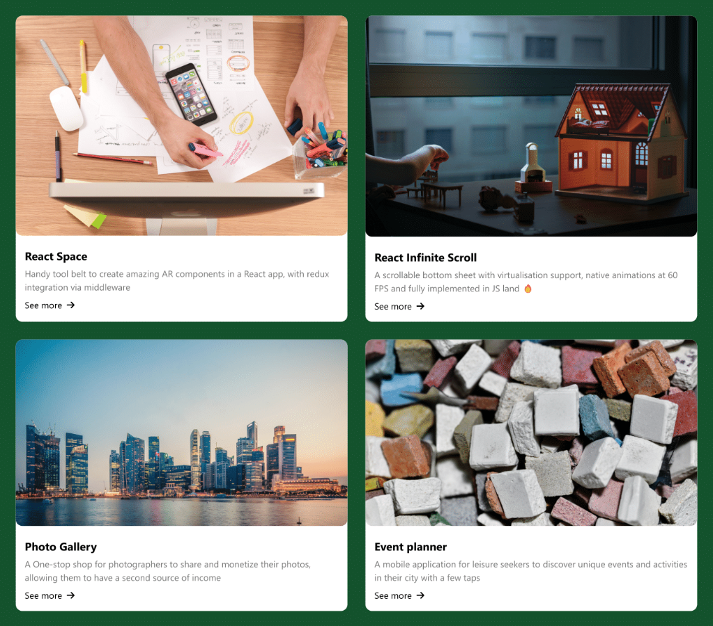

# React Basics Projects - Coursera by Meta

This repository contains a collection of projects developed during the React Basics course by Meta on Coursera. Each project demonstrates specific React concepts and techniques, offering hands-on experience in building React applications and applying React principles.

---

## 📂 Projects Overview

1. **First App**  
   A foundational React application to understand the basic setup and structure.

2. **Calculator**  
   A functional calculator app created with React to explore state and props.

3. **Advanced React App**  
   Demonstrates advanced React concepts and design patterns.

4. **Context Providers**  
   Learn about global state management using the React Context API.

5. **React Hooks**  
   Explore React hooks like `useState`, `useEffect`, and custom hooks.

6. **Integration Testing**  
   Covers how to perform integration tests in React applications.

7. **Final Project**  
   A comprehensive project incorporating all the concepts learned during the course.

---

## 🚀 Getting Started

These projects were bootstrapped with [Create React App](https://github.com/facebook/create-react-app). To get started with any project, navigate to its directory and use the following commands:

### Available Scripts

#### `npm start`
Runs the app in development mode.  
Access it at [http://localhost:3000](http://localhost:3000).  
The page will reload automatically for code changes, and errors will display in the console.

#### `npm test`
Starts the test runner in interactive watch mode.  
Learn more about [running tests](https://facebook.github.io/create-react-app/docs/running-tests).

---

## 💡 Key Features and Topics Covered

- **React Basics**: Component creation, state, and props.  
- **React Router**: Add routing capabilities with `react-router-dom`.  
- **React Hooks**: Understand and utilize `useState`, `useEffect`, and custom hooks.  
- **Context API**: Efficient state sharing across components.  
- **Testing**: Integration testing using modern tools and libraries.  
- **Third-Party Libraries**: Using packages like `react-player` for advanced functionalities.  

---

## 🛠 Setting Up a New React Project

To initialize the React application:
```bash
npm install
```

To start the development server:
```bash
npm start
```

---

## 📚 Learn More

- [React Documentation](https://reactjs.org/)  
- [Create React App Documentation](https://facebook.github.io/create-react-app/docs/getting-started)  
- [React Router Documentation](https://reactrouter.com/)  

---

## 👩‍💻 Contribution

Feel free to contribute to this repository by creating a pull request. Suggestions, bug reports, and improvements are always welcome!

---

## Final Project Overview

### Navigation Bar
The navigation bar contains essential links for easy access, including:
- **Email** for direct communication
- **GitHub**, **LinkedIn**, **Medium**, and **Stack Overflow** for professional profiles
- Links to project sections, such as **Projects** and **Contact Me**, allowing users to quickly navigate to relevant parts of the website.

### Landing Section
The landing section provides a brief introduction with an image of myself, a warm greeting, and heading text to capture the user’s attention and set the tone for the website.
<br><br>

### Projects Section
This section highlights a collection of my projects, including titles, descriptions, and images. Each project is displayed as a card with a button that would normally allow users to view more details (currently not functional). 
<br><br>

### Contact Me Section
The contact section features a form where users can submit inquiries or messages. The form includes fields for name, email, type of inquiry, and message, along with a submit button to send the information.
<br><br>

---

## Author

- [Carlos Valente](https://github.com/CFMVCarlos)